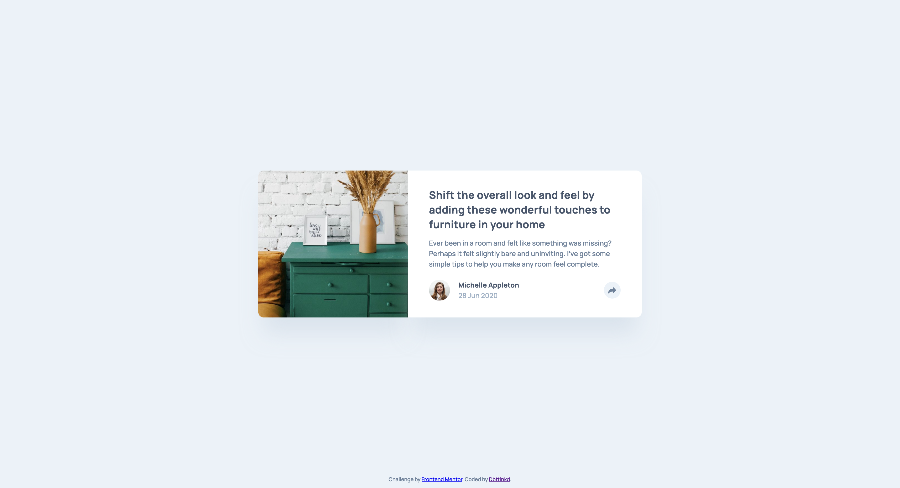
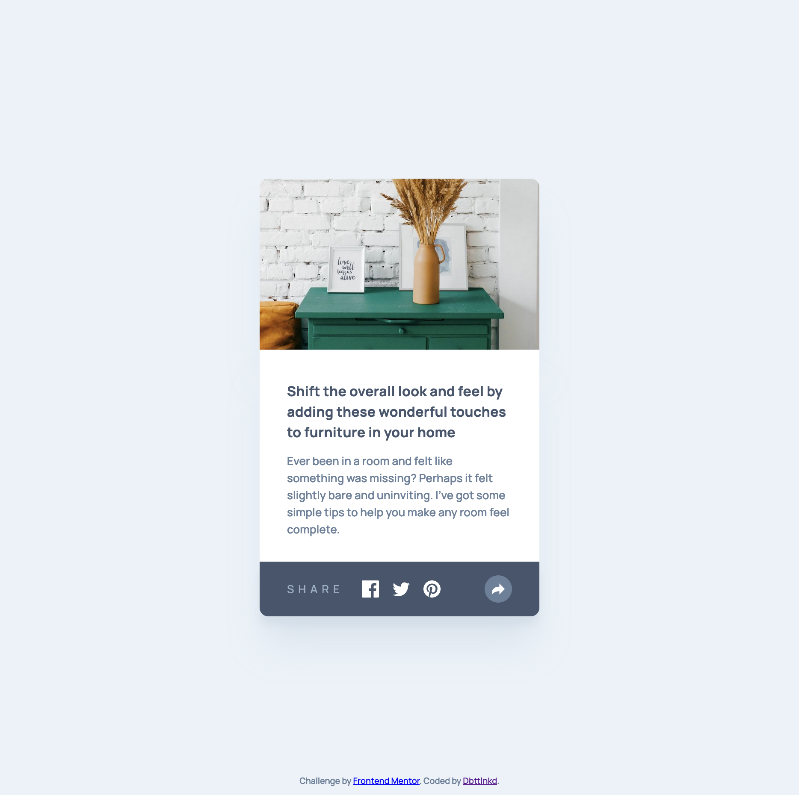

# Frontend Mentor - Article preview component solution

This is a solution to the [Article preview component challenge on Frontend Mentor](https://www.frontendmentor.io/challenges/article-preview-component-dYBN_pYFT). Frontend Mentor challenges help you improve your coding skills by building realistic projects. 

## Table of contents

- [Overview](#overview)
  - [The challenge](#the-challenge)
  - [Screenshot](#screenshot)
  - [Links](#links)
- [My process](#my-process)
  - [Built with](#built-with)
  - [What I learned](#what-i-learned)

## Overview

### The challenge

Users should be able to:

- View the optimal layout for the component depending on their device's screen size
- See the social media share links when they click the share icon

### Screenshot

### Links

- Solution URL: [Solution URL](https://your-solution-url.com)
- Live Site URL: [Live URL](https://dbttlnkd.github.io/frontend_mentor_article_preview_document/)

## My process

### Built with

- HTML5
- CSS
- Flexbox
- JavaScript

### What I learned

This is my 2nd project since I start learning HTML/CSS mid-June.
This project helped me in testing my learning around responsive design and use of JavaScript for small animations.

I spend a little time to find a way to remove the active button when clicking in the window.

Not sure if the integration of the logo directlty in CSS is the best way to do it but it works ! Don't hesitate to bring feedbacks !